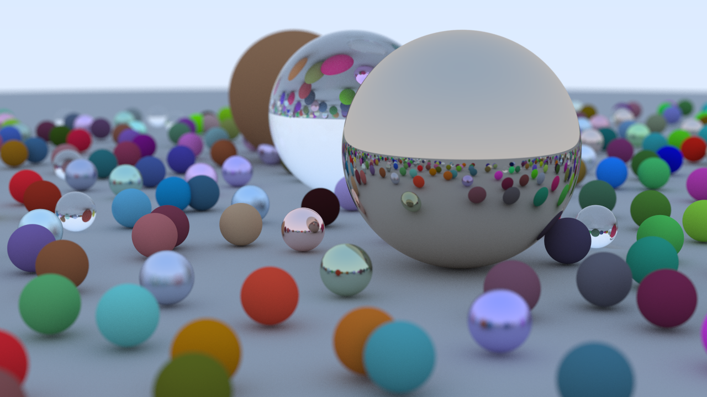

# RayTracing



A ray tracer built by following [_Ray Tracing in One Weekend_](https://github.com/RayTracing/raytracing.github.io).

## Dependencies

- C++17
- CMake 3.16+
- [SDL2](https://www.libsdl.org/) (via vcpkg, located in `vcpkg/`)

## Build

```powershell
cmake -S . -B build
cmake --build build --config Release
```

Or press **F5** in VS Code to build (Debug) and launch directly.

## Controls

| Input | Action |
|---|---|
| Left click | Next image |
| Right click | Previous image |
| Ctrl+S (while rendering) | Queue save request and auto-save after render finishes *Note File might be overwrited*|
| Ctrl+S (after rendering) | Save current rendered image immediately |
| Close window | Quit |

## Image sequence

| Name | Description |
|---|---|
| image2 | Gradient background |
| image3 | Red sphere |
| image4 | Normal-mapped sphere |
| image5 | normals-colored sphere with ground |
| image6 | image5 after antialiasing |
| image6-2 (Comparison) | Before and after antialiasing |
| image7 | First render of a diffuse sphere |
| image8 | diffuse sphere with limited bounces |
| image9 | Diffuse sphere with no shadow acne |
| image10 | Correct rendering of Lambertian spheres |
| image11 | The gamut of our renderer so far |
| image12 | The gamut of our renderer, gamma-corrected |
| image13 | Shiny metal |
| image14 | Fuzzed metal |
| image16 | Glass sphere that always refracts |
| image17 | Air bubble sometimes refracts, sometimes reflects |
| image18 | A hollow glass sphere |
| image19 | A wide-angle view |
| image20 | A distant view |
| image21 | Zooming in |
| image22 | Spheres with depth-of-field |
| image23 | Final random spheres scene |

## Adding a new image

1. Create `image_render/imageN.cpp` and implement `imageN_spec()` + `fill_imageN_scanline()`.
2. Add a self-registration block at the end of the file (copy the pattern from `image4.cpp`).
3. Declare the two functions in `image_render/image_render.h`.
4. Add `image_render/imageN.cpp` to `CMakeLists.txt`.
